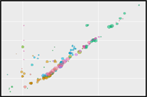
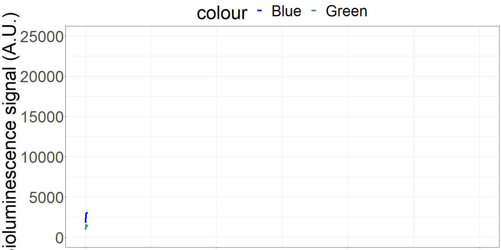
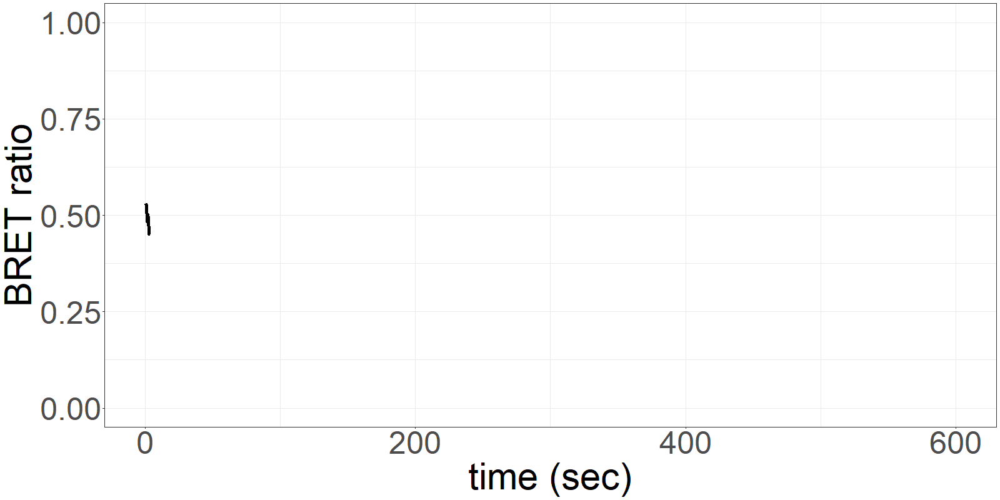
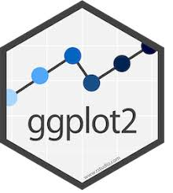
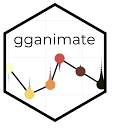
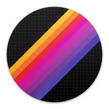

```{r setup, include=FALSE}
##  Setup and loading required libraries  ##
##                                        ##

knitr::opts_chunk$set(
  results = 'asis',
  echo = T,
  warning = FALSE,
  message = FALSE,
  fig.align = 'center'
)

#Load libraries
library(tidyverse)
library(cowplot)
library(knitr)
library(kableExtra)
library(gganimate)
library(gifski)
library(shiny)
library(plotly)
```

<style>
.column-left{float: left;width: 33%;text-align: left;}
.column-right{float: right;width: 33%;text-align: right;}
.column-center{display: inline-block;width: 33%;text-align: left;}
.column-left2{float: left;width: 50%;text-align: left;}
.column-right2{float: right;width: 50%;text-align: right;}
.column-right3{float: right;width: 50%;text-align: left;}
.column-fullwidth{float: right;width: 100%;text-align: left;}
</style>

# Introduction
In my postdoctoral fellowship, I am constructing sensors made of proteins that are based on a biophysical phenomenon called Bioluminescence Resonance Energy Transfer (BRET). A light-generating luciferase coupled to an energy acceptor such as a fluorescent protein emit light with different wavelength maxima. The available options are endless, but based on certain properties, I am designing and constructing new and superior BRET system which in turn are applied as biosensors in human blood.

# My Project

The constructed BRET systems can be modulated to measure a variety of biomarkers found in human blood. In my case, I am looking at active proteases in human serum. 

<div class="column-left2">

**Click** on the image to get redirected to a self-made `Shiny` app showcasing the available options for the development of BRET systems.

</br>
</br>

</div>

<div class="column-right2">

[](https://felixweihs.shinyapps.io/Fluorescence/)

</div>

# My Goals
**1.** Improve data visualisation (Apps, animations) <br/>
**2.** Automate data analysis (Load files from folder -> Tidy -> Raw data overview -> Data Analysis as a table)<br/>


``` {r DataAnalysis,echo=T,warning=FALSE,message=FALSE,error=FALSE}
##     This is the script doing the main job:     ##
##                1. Load Data                    ##
##                2. Tidy                         ##
##                3. Prepare analysis data        ##
##                4. Prepare analysis graph       ##

theme_set(theme_bw())
#Load files with unknown names from known folder into R studio
FileList <- list.files(path = "data", pattern="*.csv", full.names = TRUE)
AllData <- map_df(FileList, read_csv, skip = 7, .id = "dataset") 

#Replace Ratio calculation by more exact measurements and group by datasets
AllData_tidy <- AllData %>% 
  mutate(Ratio = as.numeric(Green) / as.numeric(Blue)) %>% 
  mutate(dataset = as.numeric(dataset)) %>% 
  group_by(dataset)

#Analysis
analysis_5 <- subset(AllData_tidy, Time >=300 & Time <= 320) %>% 
      summarise(five_min = mean(Ratio))
analysis_6 <- subset(AllData_tidy, Time >=360 & Time <= 380) %>% 
  summarise(six_min = mean(Ratio))
analysis_7 <- subset(AllData_tidy, Time >=420 & Time <= 440) %>% 
  summarise(seven_min = mean(Ratio))
analysis_8 <- subset(AllData_tidy, Time >=480 & Time <= 500) %>% 
  summarise(eight_min = mean(Ratio))
analysis <- full_join(analysis_5, analysis_6)
analysis <- full_join(analysis, analysis_7)
analysis <- full_join(analysis, analysis_8)

#Mutate datasets into groups
analysis_summary <- analysis %>% 
  mutate(dataset = case_when(
      dataset == "1" ~ "1",
      dataset == "2" ~ "1",
      dataset == "3" ~ "1",
      dataset == "4" ~ "2",
      dataset == "5" ~ "2",
      dataset == "6" ~ "2",
      dataset == "7" ~ "3",
      dataset == "8" ~ "3",
      dataset == "9" ~ "3",
      dataset == "10" ~ "4",
      dataset == "11" ~ "4",
      dataset == "12" ~ "4")) %>% 
  group_by(dataset)

## Putting BRET ratios together and calculate means and SD
analysis_summary5 <- summarise(analysis_summary, BRET_ratio = mean(five_min), SD = sd(five_min)) %>% add_column(minutes = 5)
analysis_summary6 <- summarise(analysis_summary, BRET_ratio = mean(six_min), SD = sd(six_min)) %>% add_column(minutes = 6)
analysis_summary7 <- summarise(analysis_summary, BRET_ratio = mean(seven_min), SD = sd(seven_min)) %>% add_column(minutes = 7)
analysis_summary8 <- summarise(analysis_summary, BRET_ratio = mean(eight_min), SD = sd(eight_min)) %>% add_column(minutes = 8)

BRETratio_summary <- full_join(analysis_summary5, analysis_summary6)
BRETratio_summary <- full_join(BRETratio_summary, analysis_summary7)

analysis_summary2 <- analysis_summary %>% 
  gather(group, value, -dataset) %>% 
  mutate(group = case_when(
    group == "five_min" ~ "5",
    group == "six_min" ~ "6",
    group == "seven_min" ~ "7",
    group == "eight_min" ~ "8")) %>% 
  group_by(dataset, group)

rm(Stats1, Stats2)
Stats1 <- summarise(analysis_summary2, mean = mean(value, na.rm=TRUE), SD = sd(value, na.rm=TRUE))
Stats2 <-  analysis_summary2 %>% summarise_each(funs(sum(!is.na(.))))
Stats_table <- full_join(Stats1, Stats2) %>% rename('incubation (min)' = group, 'n' = value) %>% ungroup()

analysis_summary2_lm <- lm(value ~ as.numeric(group), data = analysis_summary2)

graph_analysis2 <- ggplot(analysis_summary2, aes(x = as.numeric(group), y = value, colour = dataset, group = dataset)) +
          geom_point(alpha = 0.5) +
          stat_smooth(method = "lm") + ylim(0,1) +
          labs(x = "Incubation time (min)", y = "BRET ratio") +
          theme(axis.title.x = element_text(size = 14, face = "bold"),
                axis.title.y = element_text(size = 14, face = "bold"),
                legend.title = element_text(size = 14, face = "bold"),
                legend.text = element_text(size = 12, face = "bold"),
                axis.text = element_text(size = 14, face = "bold"),
                legend.key = element_rect(fill = "white"),
                legend.background = element_rect(fill = "white"))
```

``` {r Animations,warning=FALSE,message=FALSE}
##     Generate example 'run' as an   ##
##      animation using gganimate     ##


#Tidy bioluminescence and ratio data for animations
AllData_tidy_signal <- AllData_tidy %>% 
  select(1:4) %>% 
  gather(colour, Signal, -dataset, -Time)

AllData_tidy_ratio <- AllData_tidy %>% 
  select(1,2,5) %>% 
  gather(colour, Ratio, -dataset, -Time)

# Create gif for poster and presentation showing 'live' signal and ratio over time
AllData_tidy_signal2 <- AllData_tidy_signal %>% 
  filter(dataset == "6") %>% group_by(colour)

AllData_tidy_ratio2 <- AllData_tidy_ratio%>% 
  filter(dataset == "6")

graph_plot_signal2 <- ggplot(
  AllData_tidy_signal2,
  aes(x=as.numeric(Time), y=as.numeric(Signal), colour = colour)) +
  geom_line(size = 2) +
  scale_colour_manual(values = c("blue", "#31a354")) +
  labs(x = "time (sec)", y = "Bioluminescence signal (A.U.)") +
  theme(legend.position = "top") +
  ylim(0, 25000) +
  xlim(0, 600) +
  theme(axis.title.x = element_blank(),
        axis.text.x = element_blank())

graph_plot_ratio2 <- ggplot(
  AllData_tidy_ratio2,
  aes(x=as.numeric(Time), y=as.numeric(Ratio))) +
  geom_line(size = 2) +
  scale_colour_manual(values = c("black")) +
  labs(x = "time (sec)", y = "BRET ratio") +
  theme(legend.position = "bottom") +
  ylim(0, 1) +
  xlim(0, 600)

#The following code generates and renders animations, since that would take too long. I am loading pregenerated gifs.

#newanime <- graph_plot_signal2 + 
#  transition_reveal(Time)
#newanime2 <- graph_plot_ratio2 + 
#  transition_reveal(Time)

#newanime_test <- animate(newanime, height = 400, width =800, fps = 5)
#newanime_test2 <- animate(newanime2, height = 400, width =800, fps = 5)
#anim_save("Results/signal_anime.gif", animation = newanime_test)
#anim_save("Results/ratio_anime.gif", animation = newanime_test2)

```

# How to get there

## 1.The data collection system

<div class="column-left">

<br/>

The sensor is applied on a microfluidics chip in our fully integrated prototype-device (CYBERTONGUE) (Figure 1). The data analysis is quite straight forward by analysing mean BRET ratios at different incubation times (in this presentation, 5,6,7 and 8 min) (see right panel animations).
The biosensor and the sample are incubated on the chip and the result can be seen live. (Signal increases as the sensor reaches the detection chamber on the chip)

</div>

<div class="column-center">

<br/>

{width=200px}
**Figure 1** Cybertongue device and microfluidics chip

</div>

<div class="column-right">

{width=300px}
{width=300px}
**Figure 2** 'Live' signal and BRET ratios as a function of time

</div>

<br/>
<br/>

<div class="column-fullwidth">

## 2.Automated Data analysis script

</div>

<div class="column-left2">

In the past, I manually processed larger number of csv files created by the Cybertongue device. THis was done by tedious copy/paste actions between excel sheets.
The here created script automates this procedure based on the assumption that data was created as technical repeats (triplicate) and is ordered in that way in the folder.
<br/>
<br/>
<br/>
<br/>
<br/>
<br/>

</div>

<div class="column-right3">

Script processing steps:

* **Load files** from specific folder
* **Tidy up** data
* **Plot raw data** for each run to check <br/>
for run quality (by eye at the moment)
* **Analysis**: Calculate means, standard deviation, number of runs <br/>
for each incubation time, grouped by technical repeats
* Create a **table** with numbers

</div>

<br/>
<br/>
<br/>


<div class="column-fullwidth">

## 3.Example runs

</div>

``` {r RawDataPlots, warning=FALSE, message=FALSE}
##     Generate an overview of raw data     ##
##             for quality checks           ##


#Tidy bioluminescence and ratio data
AllData_tidy_signal <- AllData_tidy %>% 
  select(1:4) %>% 
  gather(colour, Signal, -dataset, -Time)

AllData_tidy_ratio <- AllData_tidy %>% 
  select(1,2,5) %>% 
  gather(colour, Ratio, -dataset, -Time)

# Produce graphs with bioluminescence data as a function of time
graph_plot_signal <- ggplot(AllData_tidy_signal, 
       aes(x=as.numeric(Time), y=as.numeric(Signal))) + 
  geom_point(aes(colour = colour)) +
  labs(title="", x="time [sec]", y = "Bioluminescence signal [A.U.]") +
  scale_colour_manual(values = c("blue", "#31a354")) + 
  theme_light() +
  theme(legend.position = "none",
        axis.title.x = element_blank(),
        axis.text.x = element_blank(),
        strip.text = element_text(face="bold", size=10, colour = "black"),
        strip.background = element_rect(fill="white", colour="black",size=2)) +
  ylim(0, 30000) +
  xlim(0, 600) +
  facet_wrap(~dataset, nrow = 1)

# Produce graphs with BRET ratio data as a function of time
graph_plot_ratio <- ggplot(AllData_tidy_ratio, 
                            aes(x=as.numeric(Time), y=as.numeric(Ratio))) + 
  geom_point() +
  labs(title="", x="time [sec]", y = "BRET Ratio (Green/Blue)") +
  scale_colour_manual(values = c("black")) +
  theme_light() +
  theme(legend.position = "none",
        strip.text = element_text(face="bold", size=10, colour = "black"),
        strip.background = element_rect(fill="white", colour="black",size=2)) +
  ylim(0, 1) +
  xlim(0, 600) +
  facet_wrap(~dataset, nrow = 1)

# Connect signal and ratio graphs
graph_plot_raw <- plot_grid(graph_plot_signal, graph_plot_ratio, 
                            ncol = 1, nrow = 2,
                            rel_heights = c(1,1))
graph_plot_raw
```
**Figure 3** Plotting raw data for quality check

<br/>

<div class="column-fullwidth">

## 4.Analysis summary

</div>

<br/>

<div class="column-left2">

<br/>
<br/>
``` {r,warning=FALSE,message=FALSE}
##          Load results plot               ##
##                                          ##

graph_analysis2 
```
**Figure 4** Individual BRET ratio values dependent on incubation time

\[\Rightarrow\] The script identified that run 8 did not detect the entire run which is considered in the analysis (see sample number). The graph also shows that dataset3  has a big variance (shades) pointing out that something might have gone wrong with the measurements. the other two datasets look like they likely represent technical repeats.

</div>

<div class="column-right2">

``` {r,warning=FALSE,message=FALSE}
##     Load and define table with resultis  ##
##                                          ##
Stats_table %>% knitr::kable() %>% 
  kable_styling("striped", position = "center", font_size = 10, full_width = FALSE) %>% 
  column_spec(1, bold = T, border_right = T)
```
**Table 1** Analysis overview

</div>

<div class="column-fullwidth">

# My Digital Toolbox

* `tidyverse` for programming, 
* `cowplot`, `gganimate`, `gifski` and `plotly` for visualisations
* `shiny` for a spectral/fluorescent app
* `knitr` and `kableExtra` for generating this html presentation

</div>

<div class="column-fullwidth">

### Favourite tool

</div>

<div class="column-left2">

* I am aware that we did not really cover `shiny` (as of 13/11) but I absolutely &hearts; it

</div>

<div class="column-right2">

{width=100px}

</div>

<div class="column-fullwidth">

# My time went ...

Writing a neat, fast working data analysis script was tricky but I am very happy with the result. It is amazing how many roads are actually leading to Rome. Some of them are muddy, slow and hard to follow. Programming the shiny things app was lots of fun and my girlfriend was sort of disturbed of how much time I spent on it on the weekends.

# Next steps

* The tidier-analysis script can only be accessed via RStudio at the moment. I would like to integrate the script into a published Shiny app to make it available to the group.</br> 
* The existing shiny things database I created could be extended to integrate spectral information. This would be the first application, combining fluorophore property search functions with spectral visualisations, using a comprehensive database. </br> 

# My Data School Experience

I really enjoyed the course (I rarely say that :) ). To learn programming in `R` required me to break my way of thinking. But as soon as I got into it (with the help of google), it is fantastic. Visualisations with `ggplot`, `gganimate` and `shiny` are great but sometimes I got lost in adjusting irrelevant elements such as the font of the x-axis label. I am glad that the statistics part not only covered how to apply them in `R`, but also covered the concepts of the respective tests. Thanks a lot to everyone who was involved! Great job!

</div>


<div class="column-fullwidth">

Brought to you by:
{width=70px} {width=70px} {width=70px} {width=70px} {width=70px} {width=70px} {width=70px} {width=70px}

</div>

